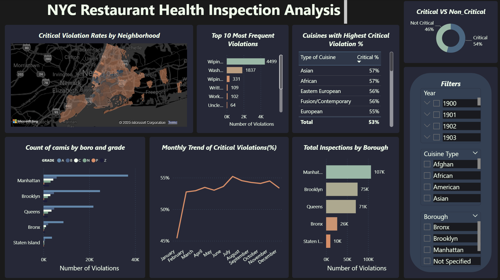

# NYC Restaurant Health Inspection Analysis 🍽️📊

A comprehensive data analysis project examining restaurant health inspection results across New York City to identify patterns in violations, grades, and cuisine safety performance.

## 📋 Project Overview

This project analyzes NYC Department of Health restaurant inspection data to provide insights for improving public health policies, inspection scheduling, and food safety education. The analysis helps city leadership understand which types of restaurants struggle with food safety, which neighborhoods are at highest risk, and what violations are most common.

## 🎯 Business Problem

The NYC Department of Health needs data-driven insights to:
- Identify patterns in restaurant violations and grades
- Understand which cuisines and neighborhoods have the lowest food safety performance
- Determine where to focus inspections, policies, or education to improve food safety
- Track how restaurant grades and violations vary across boroughs and over time

## 🛠️ Tech Stack

- **SQL Server** - Data cleaning, transformation, and analysis
- **Power BI** - Data visualization and interactive dashboards
- **Git** - Version control

## 📁 Project Structure

```
├── 01_data_preparation.sql          # Data cleaning and standardization
├── 02_overall_insights.sql          # Borough and grade distribution analysis
├── 03_violation_analysis.sql        # Violation patterns and critical violations
├── 04_cuisine_analysis.sql          # Cuisine-specific safety performance
├── Restaurant_Health_Inspection_Analysis_NYC.pbix  # Power BI dashboard
└── README.md                        # Project documentation
```

## 🔄 Data Preparation Process

### Data Cleaning Steps:
1. **Missing Value Handling**
   - Replaced NULL cuisine descriptions with 'Not Specified'
   - Set missing grades to 'Inspection pending'
   - Standardized inspection types for pending inspections
   - Handled borough data inconsistencies

2. **Data Standardization**
   - Grouped similar cuisines into broader categories:
     - Asian (Chinese, Japanese, Thai, Korean, etc.)
     - American (Traditional American, BBQ, Hamburgers, etc.)
     - European (Italian, French, Greek, etc.)
     - Mediterranean/Middle Eastern
     - Latin/Caribbean
     - And more...

3. **Data Type Conversion**
   - Converted inspection and grade dates to proper datetime format

## 📊 Key Analysis Areas

### 1. Overall Insights
- **Borough Analysis**: Total inspections by NYC borough
- **Grade Distribution**: Distribution of A, B, C grades across the city
- **Inspection Types**: Analysis of initial, re-inspection, and pre-permit inspections

### 2. Violation Analysis
- **Top Violations**: Most frequent violation codes and descriptions
- **Critical vs Non-Critical**: Comparison of violation severity
- **Geographic Patterns**: Boroughs with highest critical violation rates

### 3. Cuisine Analysis
- **Grade Performance**: Grade distribution by cuisine type
- **Score Analysis**: Cuisines with lowest average inspection scores
- **Safety Patterns**: Cuisines with highest proportion of critical violations

## 🔍 Key Findings & Insights

### Top Research Questions Answered:
1. **Which violations are most common, and where do they occur most frequently?**
2. **Which cuisines and neighborhoods have the lowest food safety performance?**
3. **How do restaurant grades and violations vary across boroughs and over time?**
4. **Where should the city focus inspections, policies, or education to improve food safety?**

## 📈 Power BI Dashboard Features 

The interactive Power BI dashboard (`Restaurant_Health_Inspection_Analysis_NYC.pbix`) includes:

- 🗺️ **Geographic Visualizations**: Borough-wise performance maps
- 📊 **Grade Distribution Charts**: Visual breakdown of restaurant grades
- 🎯 **Violation Analysis**: Critical vs non-critical violation trends
- 🍜 **Cuisine Performance**: Safety scores by cuisine type
- 📅 **Time Series Analysis**: Trends over inspection periods
- 🎛️ **Interactive Filters**: Borough, cuisine, grade, and date filters

## 🚀 How to Use This Project

### Prerequisites
- SQL Server or compatible database system
- Power BI Desktop
- Access to NYC restaurant inspection dataset

### Setup Instructions
1. **Clone the repository**
   ```bash
   git clone [your-repository-url]
   ```

2. **Database Setup**
   - Import the NYC restaurant inspection dataset into your SQL database
   - Ensure the table is named `inspection_results`

3. **Run SQL Analysis**
   - Execute scripts in order: `01_data_preparation.sql` → `02_overall_insights.sql` → `03_violation_analysis.sql` → `04_cuisine_analysis.sql`

4. **Power BI Dashboard**
   - Open `Restaurant_Health_Inspection_Analysis_NYC.pbix`
   - Update data source connections to your database
   - Refresh data to load latest analysis results

## 💡 Recommendations

Based on the analysis, the project provides actionable recommendations for:

- **Targeted Inspections**: Focus areas with highest violation rates
- **Public Health Campaigns**: Neighborhoods requiring additional food safety education
- **Policy Development**: Evidence-based policy improvements
- **Training Programs**: Cuisine-specific safety training initiatives

## 📧 Contact

Feel free to reach out for questions, suggestions, or collaborations!

## 🔗 Data Source

NYC Open Data - Restaurant Inspection Results
*Note: This project uses publicly available NYC Department of Health inspection data*

## 🎓 Project Credit

This project is based on the **Restaurant Health Inspection Analysis - NYC** project from [Analyst Builder](https://www.analystbuilder.com/projects/restaurant-health-inspection-analysis-nyc-FhAOm). The business requirements and dataset were provided by Analyst Builder, with analysis and visualization implementation completed independently.

---

**Project Status**: ✅ Complete - Analysis & Visualization Ready

*This project demonstrates end-to-end data analysis skills including data cleaning, SQL analysis, and business intelligence visualization using real-world public health data.*

